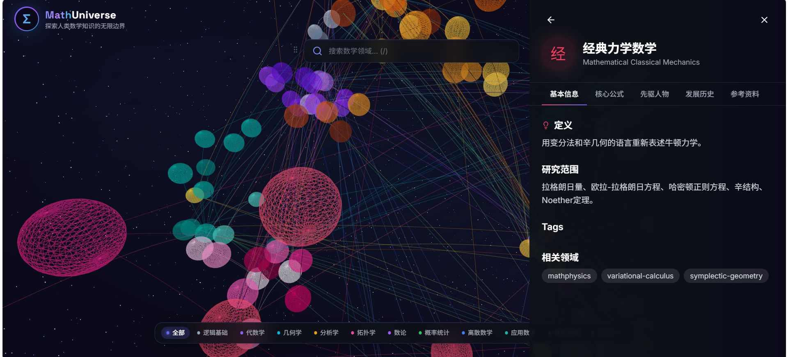
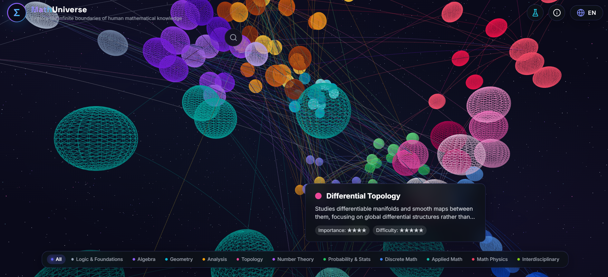

# Math Universe / 数学宇宙

[English](#english) | [中文](#chinese)

---

## English

**Math Universe** is an interactive 3D mathematical visualization web application that brings mathematical concepts to life through immersive three-dimensional experiences.

### Features

- **Interactive 3D Visualization**: Experience mathematical concepts in 3D space using Three.js and React Three Fiber
- **Advanced Mathematical Rendering**: Beautiful mathematical formula rendering with KaTeX
- **Smooth Animations**: Fluid animations powered by Framer Motion
- **Internationalization**: Full bilingual support (English and Chinese) with i18next
- **Responsive Design**: Optimized for desktop, tablet, and mobile devices
- **Modern Architecture**: Built with React 18, TypeScript, and modern web technologies

### Screenshots





### Tech Stack

- **Frontend Framework**: React 18.2.0
- **Language**: TypeScript 5.3.0
- **3D Graphics**: Three.js, React Three Fiber, React Three Drei
- **Animations**: Framer Motion
- **Styling**: Tailwind CSS
- **Math Rendering**: KaTeX
- **Icons**: Lucide React
- **Routing**: React Router DOM
- **State Management**: Zustand
- **Internationalization**: i18next, react-i18next
- **Build Tool**: Vite 5.0.0

### Installation

```bash
# Clone the repository
git clone <your-repo-url>
cd math-universe

# Install dependencies
npm install
```

### Development

```bash
# Start development server
npm run dev

# The application will be available at http://localhost:5173
```

### Build

```bash
# Build for production
npm run build

# Preview production build
npm run preview
```

### Linting

```bash
# Run ESLint
npm run lint
```

### Project Structure

```
math-universe/
├── src/
│   ├── components/    # React components
│   ├── pages/         # Page components
│   ├── hooks/         # Custom React hooks
│   ├── utils/         # Utility functions
│   ├── stores/        # Zustand state stores
│   ├── locales/       # i18next translation files
│   └── types/         # TypeScript type definitions
├── public/            # Static assets
└── index.html         # Entry HTML file
```

### Contributing

Contributions are welcome! Please feel free to submit a Pull Request.

### License

This project is licensed under the MIT License - see the [LICENSE](LICENSE) file for details.

### Acknowledgments

- [React](https://reactjs.org/)
- [Three.js](https://threejs.org/)
- [Vite](https://vitejs.dev/)
- [Tailwind CSS](https://tailwindcss.com/)
- All other open-source libraries and tools used in this project

---

## Chinese

**Math Universe（数学宇宙）**是一个交互式 3D 数学可视化 Web 应用程序，通过沉浸式的三维体验将数学概念变为现实。

### 特性

- **交互式 3D 可视化**：使用 Three.js 和 React Three Fiber 在三维空间中体验数学概念
- **高级数学渲染**：使用 KaTeX 渲染精美的数学公式
- **流畅动画**：由 Framer Motion 驱动的流畅动画效果
- **国际化支持**：基于 i18next 的完整中英文双语支持
- **响应式设计**：针对桌面、平板和移动设备优化
- **现代架构**：基于 React 18、TypeScript 和现代 Web 技术构建

### 技术栈

- **前端框架**：React 18.2.0
- **编程语言**：TypeScript 5.3.0
- **3D 图形**：Three.js、React Three Fiber、React Three Drei
- **动画库**：Framer Motion
- **样式**：Tailwind CSS
- **数学渲染**：KaTeX
- **图标**：Lucide React
- **路由**：React Router DOM
- **状态管理**：Zustand
- **国际化**：i18next、react-i18next
- **构建工具**：Vite 5.0.0

### 安装

```bash
# 克隆仓库
git clone <你的仓库地址>
cd math-universe

# 安装依赖
npm install
```

### 开发

```bash
# 启动开发服务器
npm run dev

# 应用将在 http://localhost:5173 运行
```

### 构建

```bash
# 生产环境构建
npm run build

# 预览生产构建
npm run preview
```

### 代码检查

```bash
# 运行 ESLint
npm run lint
```

### 项目结构

```
math-universe/
├── src/
│   ├── components/    # React 组件
│   ├── pages/         # 页面组件
│   ├── hooks/         # 自定义 React Hooks
│   ├── utils/         # 工具函数
│   ├── stores/        # Zustand 状态管理
│   ├── locales/       # i18next 翻译文件
│   └── types/         # TypeScript 类型定义
├── public/            # 静态资源
└── index.html         # 入口 HTML 文件
```

### 贡献

欢迎贡献！请随时提交 Pull Request。

### 许可证

本项目采用 MIT 许可证 - 详见 [LICENSE](LICENSE) 文件。

### 致谢

- [React](https://reactjs.org/)
- [Three.js](https://threejs.org/)
- [Vite](https://vitejs.dev/)
- [Tailwind CSS](https://tailwindcss.com/)
- 以及项目中使用的所有其他开源库和工具

---

### 注 / Note

> This project was developed with the assistance of [CodeBuddy](https://www.codebuddy.ai/).
>
> 本项目在 [CodeBuddy](https://www.codebuddy.ai/) 的辅助下开发完成。
